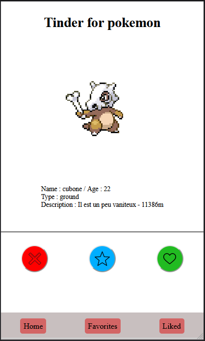
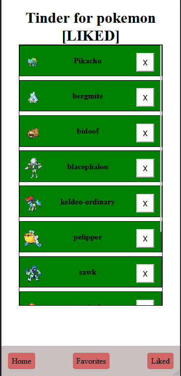
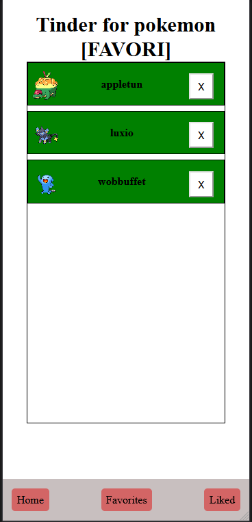
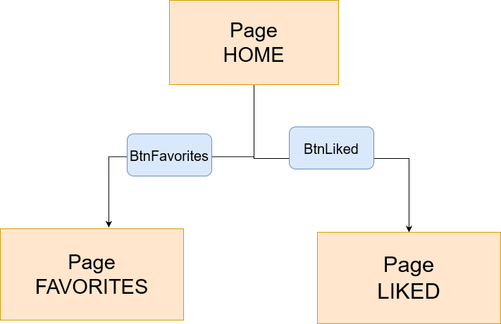

# Documentation tinderForPokemon

## But

Créer une application smartphone aient les mêmes fonctionalités de bases que tinder mais pour les pokemon.

### Qu'est cer que tinder

Tinder est une application téléphone pour les hhumains.
Elle permet à une personne d'aimer ou pas des profiles qui lui son présenter .
Si une personne aime le profile d'une personne et que cette personne fait de même en aimant le compte de la première personne alors les deux vont "matcher". Ainsi ils vont pouvoir commencé à discuter.
Quand un utilisateur n'aime pas un profile il a la possibilité de ne pas l'aimer (dislike). Alors sa se moment le profile et rejeter.

## Design de l'application

L'application compte trois pages. 
 - page homme   
 - page des pokemon liker  
 - page des favoris  

#### Navigation entre les différentes pages

## Technologie
- IndexDB
- MockAPI
- ServiceWorker (PWA)
- JavaScript, Css, HTML
- FlexBox
- PokeApi (api permetant la récupération des données lier au pokemon)

## Difficulter / Facilité

### Difficulter
- JavaScript
  - Peux d'expérience 
  - Pas très alaise avec le language
- Les promesse

### Facilité 
- Design (FlexBox)
- IndexDB
  - Mis en place facilement
- MockAPI
  - Solution rapide pour mettre en place une api

## Bilan

J'ai apprècié réaliser se projet pour plusieur raisons.
Déjà nous pouvions nous entre aider avec mes camarades, personnellement grace a cela j'ai pue avancer et comprendre ce que je fessais faux. 

Également j'ai le faites d'avoir un produit qui est utilisable sur son téléphone a la fin du travaille est très satisfesant. 

Par contre j'ai malgrès tout ue pas mal de mal avec les prommesses. Mais au final grace a l'aide du proffeusseur j'ai reussi a résoudre c'est souci.