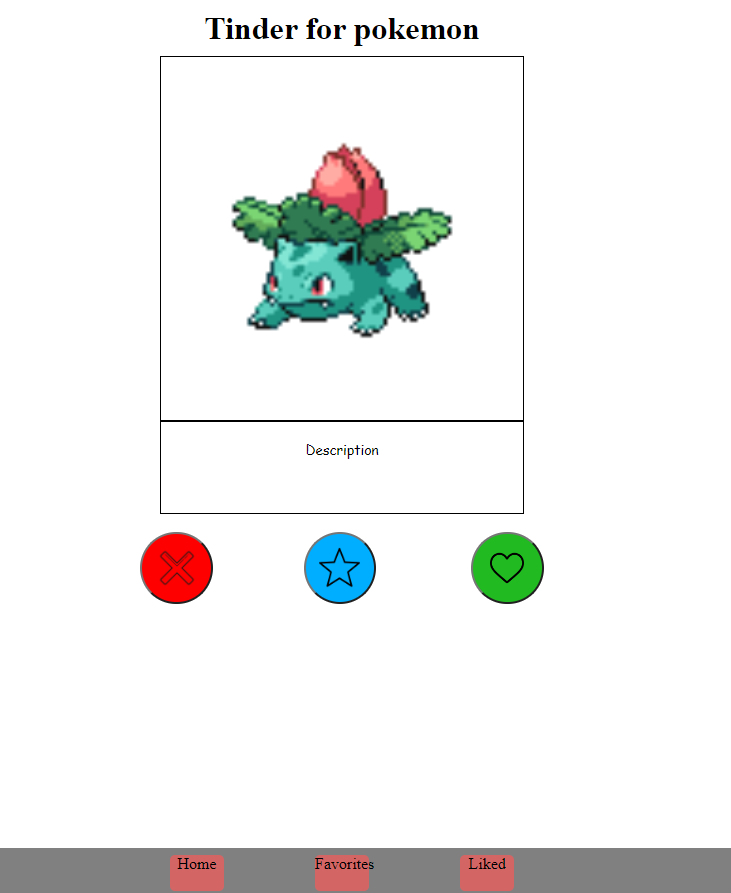

# Jouranl de board de tinderForPokemon

## 06.09.2022
Explication du professeur sur le cour.
Premier jour de travaille sur le projet tinder for pokemon. 
Je n'ai malheureusement pas pe beacoup avancer car il a fallut mettre en place les environement de développement.

## 13.09.2022
Création d'un premier design papier crayon.
A partir du desgin précèdement fais j'ai desginer une première version de l'application.

## 20.09.2022
Création de l'indexDB. (Base de donné dans le navigateur semblable à du cache)
Probleme de prioriter. Certaine action ne se fessais pas dans le bonne ordre a cause des promesse. (fonction getAllPoekemon ne ce fait pas au bon moment)
Fin de journé problème de promesse résolu.
## 27.09.2022
Absent car malade
## 04.10.2022
Création de l'api en utilisant mockAPi.
J'ai ajouté les fonctions d'ajout a l'api les pokemons au meme endroit que la fonction qui ajout dans index DB.

Création de deux menu. LIKED --> pokemon liker // FAVORIT--> pokemon mis dans les favorits
https://633bd3cdc1910b5de0caa607.mockapi.io/
## 11.10.2022
Création de la pwa.

Ajoute du service worker.
Ajoute du manifest. Lors de la création de ce dernier j'ai eu des problèmes avec l'icones. Car elle doit impérativement faire 144X144. J'ai pue résoudre se problème en redimentionant l'image.
Création d'une icone.

## 18.10.2022
Présentaion application avec powerPoint. (je note samuel)